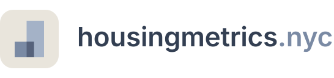

  <picture>
    <source media="(prefers-color-scheme: dark)" srcset="brand/logo-dark.svg">
    
  </picture>

The easiest way to keep track of housing production in all of New York City's neighborhoods.

Access the dashboard: [https://public.tableau.com/app/profile/luke.lavanway5938/viz/NYCOpenHousingMetricsDashboardpre-alphaversion/Sheet1#1](https://public.tableau.com/app/profile/luke.lavanway5938/viz/housingmetrics_nycDashboard/Map)

Questions or issues? Email luke (at) housingmetrics.nyc

## How to contribute

1. Clone the repo to your local machine.
2. Install dependencies.
3. Set up your dev database. definitions.py sets the BACKEND variable to 'duckdb' by default, which points Dagster to a DuckDB instance created on your machine. Run dagster dev from the terminal, then use the graphical webserver interface to materialize all assets. This creates a DuckDB instance on your machine where you can query all project assets.
4. Make your changes and submit a pull request. If you are adding a data source, provide instructions on how to access the data source in the PR.
5. For dashboard changes, clone the dashboard and send in the updated Tableau workbook.
